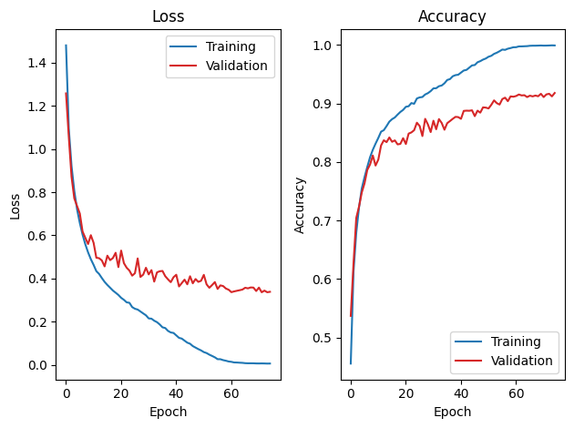
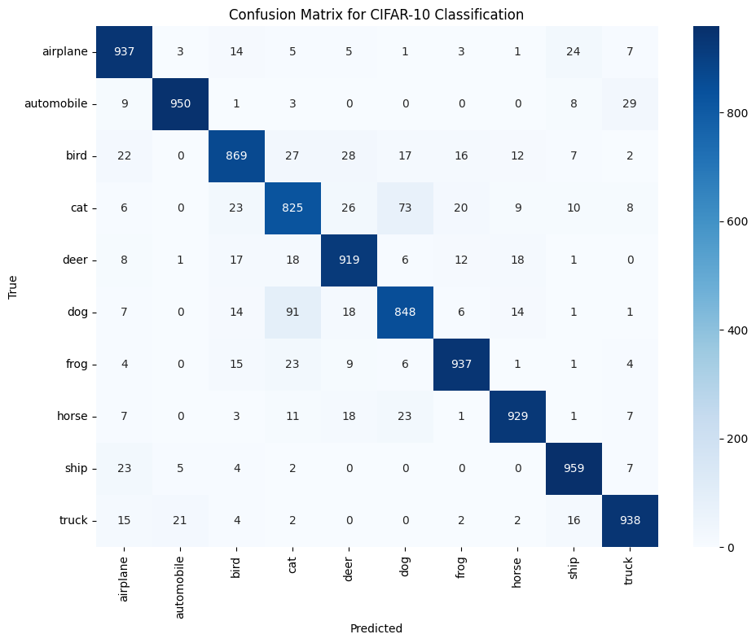
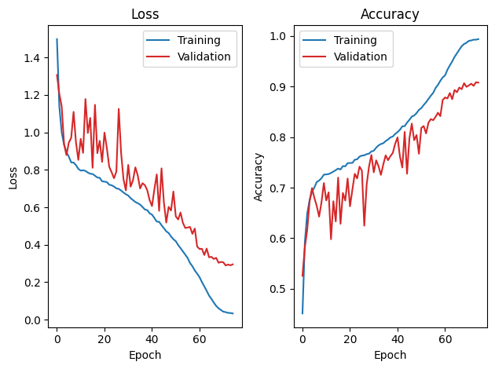

# Lab 1 - Homework Template

## 1. Model Architecture (10%)

* Describe how the `forward()` method and the `fuse_model()` function were implemented. Explain the rationale behind your design choices, such as why certain layers were fused and how this contributes to efficient inference and quantization readiness.

### forward()
* method : 將輸入資料依序通過feature extractor和classifier。
* implemented : feature extractor由Conv2d到BatchNorm2d再到ReLU，最後再到MaxPool2d，至於Conv1~5的配置都是依照課程的VGG配置(Conv3~4 沒有MaxPool)。另外在進到classifier的full connected layer 之前會將特徵圖攤平(以VGG來說就是把256張的4x4特徵圖攤平成一維度256x4x4=4096的一維特徵向量)。

### fuse_model()
* method : 使用`torch.ao.quantization.fuse_modules`將相鄰的運算子綁一起運算。
* implemented : 對於feature extractor，融合Conv、BatchNorm和ReLU。對於classifier，融合Linear和ReLU。

### Design choices
由於計算需要大量搬動記憶體資料，所以把相鄰的網路層參數合併成單一運算子。更重要的是，在量化的過程中，融合可以避免ReLU造成INT8跟FP32之間轉換造成的精度損失。

## 2. Training and Validation Curves (10%)

* Provide plots of **training vs. validation loss** and **training vs. validation accuracy** for your best baseline model.





* Discuss whether overfitting occurs, and justify your observation with evidence from the curves.


在訓練過程中可以看到Epoch 60之前Training 跟 validation loss都在下降，但到了Epoch 60後Training loss持續下降，而validation loss呈現停滯狀態。這種明顯的分歧拉大了generalization gap，表示模型已經overfitting，開始`背答案`，而不是學習特徵。

## 3. Accuracy Tuning and Hyperparameter Selection (20%)

Explain the strategies you adopted to improve accuracy:

- **Data Preprocessing:** What augmentation or normalization techniques were applied? How did they impact model generalization?

使用RandomCrop(32, padding=4)以及RandomHorizontalFlip()來增強。這些技術引入了平移不變性並增加了空間配置的多樣性，有效地提升了模型對未見過之驗證資料的泛化能力。另外也使用CIFAR-10 資料集的平均值和標準差進行了正規化以穩定梯度計算。


- **Hyperparameters:** List the chosen hyperparameters (learning rate, optimizer, scheduler, batch size, weight decay/momentum, etc.) and explain why they were selected.
* Optimizer : 選擇SGD而不是Adam，因為Adam收斂快但是泛化能力不佳，所以我採用SGD。
* Learning rate : 原先用0.001，後來改成0.01，因為步伐太慢所以我調高學習率。
* Scheduler : 選擇 Cosine Annealing 的原因在於其平滑的學習率衰減特性。相較於 MultiStepLR 斷崖式的下降，Cosine Annealing在初期能以較高的學習率跳出局部最佳解，而後期在全局最佳解的底部進行微調。
* batch size : 32
* weight decay/momentum : weight decay原先是5e-4後來改為1e-3，為了避免過度依賴少數幾個特徵點，而必須學習通用特徵。

調完後準確率由89%->91%

- **Ablation Study (Optional, +10% of this report):** Compare different hyperparameter settings systematically. Provide quantitative results showing how each parameter affects performance.

You may summarize your settings and results in a table for clarity:

| Hyperparameter | Loss Function | Optimizer | Scheduler | Weight Decay / Momentum | Epochs | Final Accuracy |
| -------------- | ------------- | --------- | --------- | ----------------------- | ------ | -------------- |
| Value          | CrossEntropy  | SGD       | CosineAnn | 1e-3 / 0.9              | 75     | 91.11%           |
```
Evaluating: 100%|██████████| 313/313 [01:20<00:00,  3.87it/s]
Test Accuracy: 91.11% | Loss: 0.4043
```


### 實驗一 : 調高weight decay 
| Hyperparameter | Loss Function | Optimizer | Scheduler | Weight Decay / Momentum | Epochs | Final Accuracy |
| -------------- | ------------- | --------- | --------- | ----------------------- | ------ | -------------- |
| Value          | CrossEntropy  | SGD       | CosineAnn | 5e-3 / 0.9              | 75     | 91.56%           |

```
Evaluating: 100%|██████████| 313/313 [00:03<00:00, 93.52it/s] 
Test Accuracy: 91.56% | Loss: 0.2794
```
發現weight decay改大雖然可以提升準確度，但是他在前期accuracy跟loss會巨幅的震盪。


### 實驗二 : 減少Epoch 
| Hyperparameter | Loss Function | Optimizer | Scheduler | Weight Decay / Momentum | Epochs | Final Accuracy |
| -------------- | ------------- | --------- | --------- | ----------------------- | ------ | -------------- |
| Value          | CrossEntropy  | SGD       | CosineAnn | 1e-3 / 0.9              | 60     | 91.43%           |

```
Evaluating: 100%|██████████| 313/313 [00:02<00:00, 105.47it/s]
Test Accuracy: 91.43% | Loss: 0.3646
```
可以看到圖片改epoch並不會改變accuracy，除非在overfitting之前提早結束。
v
:::info
The table is for reference only. Students can list the techniques they have used on their own.
:::

## 4. Custom QConfig Implementation (25%)

Detail how your customized quantization configuration is designed and implemented:

1. **Scale and Zero-Point:** Explain the mathematical formulation for calculating scale and zero-point in uniform quantization.

* Scale : $\tag{2}
\begin{align}
s = \frac{ x_\max - x_\min }{ q_\max - q_\min} \end{align}$

`Scale是用來決定量化的step size`
$\begin{align} {x_\max}/{x_\min} \end{align}$ 會用實際用到的張亮最大最小值，而量化的值會是能表示的最大最小值。

以 activation 為例，因為我使用quint8，所以我的`q_max`是255，而`q_min`是0。
以 weight 為例，因為我使用qint8，所以我的`q_max`是127，而`q_min`是-128。

* Zero-Point : $\tag{1}
\begin{align}
z &= \text{clamp} \left( round(q_\min - \frac{x_\min}{s}) , q_\min, q_\max \right) 
\end{align}$

`Zero-Point 確保浮點數中的0.0 能夠被精準地映射到一個整數值上。這對於 Zero-padding 或是 ReLU 很重要，能避免 0.0 在量化後產生數值偏移。`


2. **CustomQConfig Approximation:** Describe how the `scale_approximate()` function in `CusQuantObserver` is implemented. Why is it useful?

    一. Edge Case Handling : 在開始前先檢查scale是否≤`1e-15`。如果是回傳1，避免產生無限大的負數。
    二. Logarithmic Transformation : 利用 `k = round(math.log2(scale))`，對scale取lg，以及最接近的整數。
    三. Bounding : 把k限制在[-8,8]之間，避免位移量超過能表示的bits數。
    四. Reconstruction : 用$2^{k}$還原。
    
傳統上的乘法需要耗費大量的能源以及cycle數，而用位移不但減少硬體成本，也能減少耗能以及降低延遲，所以是非常有用的。

3. **Overflow Considerations:** Discuss whether overflow can occur when implementing `scale_approximate()` and how to prevent or mitigate it.
    一. Edge Case Handling : 在開始前先檢查scale是否≤`1e-15`。如果是回傳1，避免產生無限大的負數。
    二. Bounding : 把k限制在[-8,8]之間，避免位移量超過能表示的bits數。

## 5. Comparison of Quantization Schemes (25%)

Given a **linear layer (128 → 10)** with an input shape of 1×128 and an output shape of 1×10, along with the energy costs for different data types, we will use the provided table to estimate the total energy consumption for executing such a fully connected layer during inference under the following two scenarios:

1. Full precision (FP32)
2. 8-bit integer, power-of-2, static, uniform symmetric quantization
    - activation: UINT8
    - weight: INT8


| Operation                        | Energy consumption (pJ)    |
| -------------------------------- | -------------------------- |
| FP32 Multiply                    | 3.7                        |
| FP32 Add                         | 0.9                        |
| <font color=red>INT32 Add</font> | <font color=red>0.1</font> |
| INT8 / UINT8 Multiply            | 0.2                        |
| INT8 / UINT8 Add                 | 0.03                       |
| Bit Shift                        | 0.01                       |

You can ignore the energy consumption of type casting, memory movement, and other operations not listed in the table.

You can refer to the following formula previously-mentioned in the lab handout:
$$
\tag{6}
\bar y_i = \left( \text{ReLU}(\bar b_i + \sum_j (\bar x_j - 128) \cdot \bar w_{ji}) \gg \overbrace{(c_x + c_w - c_y)}^\style{color:#ee0000}{\text{pre-computed offline}} \right) + 128
$$

Write down your **calculation process** and **answer** in detail.
:::warning
Answers without the process will only get partial credit.
:::

硬體的公式
* x-128 : 在軟體上activation的範圍是[0,255]，而0.0被對齊到128。在硬體做乘法之前必須先扣掉基準點(128)，讓他從uint8變回int8，這可以讓硬體減少面積成本。
* xW : 基本的MAC運算。
* ReLU : 把≤0的值都用成0。
* shift : scale_approximate()所使用的方法。
* +128 : 把前面int8變回原本的uint8。


輸入維度為 1×128、輸出維度為 1×10 的 Fully Connected Layer 為基準，總共有 10 個輸出神經元，每個神經元需要與 128 個輸入特徵進行內積。
1. FP32
    * FP32 multiply : 128(127+1(bias))x10x3.7 = 4736pJ
    * FP32 add : 128x10x0.9 = 1152pJ
    * Energy consumption :  4736pJ + 1152pJ = 5888pJ
2. Quantization
    * INT8/UINT8 multiply : 128x10x0.2 = 256pJ
    * INT8/UINT8 add : 10x0.03 = 0.3pJ
    * INT32 add : 128x0.03 + 128x10x0.1 = 131.84pJ
    * Bit Shift : 10x0.01 = 0.1pJ
    * Energy consumption : 256 + 131.84 + 0.3 + 0.1 = 388.24pJ 
    
    


### Your Answer

|                         | Before quantization (FP32) | After quantization |
| ----------------------- | ---- | --------- |
| Energy consumption (pJ) | 5888pJ | 388.24pJ |

## 6. Discussion and Conclusion (10%)

- What challenges did you face in training or quantization, and how did you address them?
問題：scale_approximate():在一開始忽略了取log2後，如果數值太小會導致無限大負數。另外，算出的位移量若不加限制，有可能會超過硬體位移暫存器 所能支援的最大位元數，導致硬體產生的截斷錯誤。
解決：引入邊界處理機制。當 scale ≤ 1e-15 時直接回傳 1.0；接著使用 min 與 max 函數將位移量 k 強制裁切在 [-8, 8] 之間，確保軟體參數能契合硬體的規格。

- Any feedbacks for Lab1 Quantization?
從FP32降到INT8，且用shift方式可以讓功耗從5888pJ降到388.24pJ。高達 93% 的能耗縮減，讓我體會到將浮點數乘法替換成位移對於硬體加速器的巨大價值。