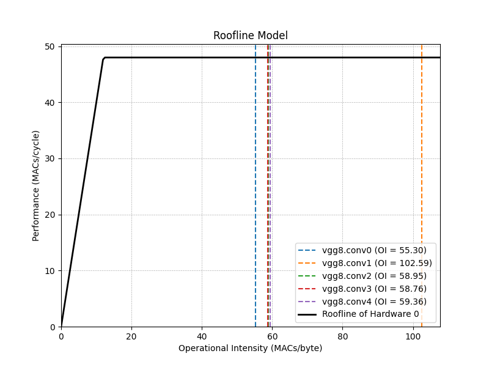
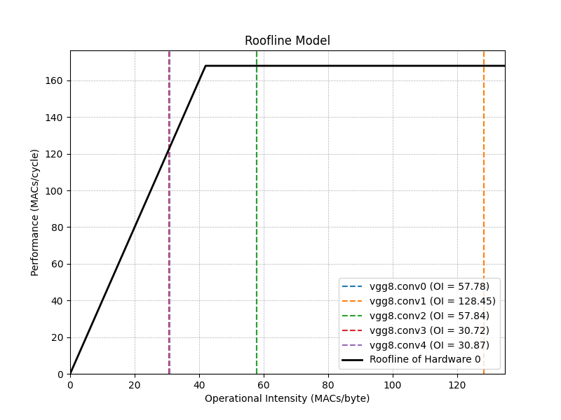
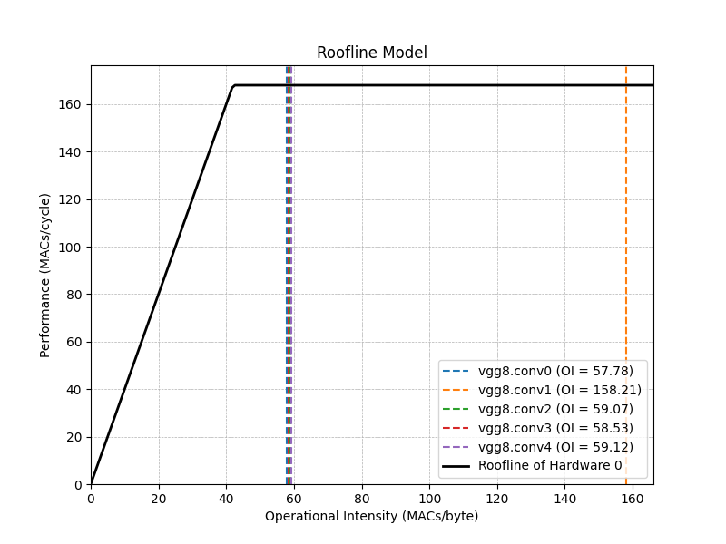

# Lab 2 - Homework Template

## Workload Analysis (10%)

### 1. Model Architecture
Eyeriss 採用Row-Stationary (RS) dataflow，其核心設計在於最小化資料搬運的能源消耗，也就是他會重新配置空間架構，去計算CNNs。相對於傳統的Weight-Stationary 或Output-Stationary，RSdataflow透過在ProcessingElement(PE)內部的Scratchpad Memory (SPAD)中盡可能長時間地保留資料，在paper中可以看到耗能最高的是DRAM，再來是GLB，所以他們可以做到的是降低對全域緩衝區(GLB) 或外部DRAM 的存取次數。傳統的WS 是把filter 固定在PE，在卷積運算中ifmap 和psum 必須在PE間頻繁流動，雖然filter 很省電，但是ifmap和psum 的移動次數過多，導致整體耗電量依然很高。而傳統的OS 是把psum 固定在PE，一樣的是他也必須一直把filter跟ifmap 從DRAM搬進PE，在這樣的情況下，他們才選擇用RS，而不是WS和OS。

- Vgg8 :
    標準的卷積神經網路架構，數值是連續分佈的，在硬體上需要依賴標準且耗能的MACs進行卷積計算。

- Vgg8-power2 :
     經過量化處理的 VGG-8，架構 與vgg完全相同，但其權重被嚴格限制為 2 的冪次方或 0。這種架構層面，使硬體可以將昂貴的乘法運算替換為低功耗的shift；同時，其帶來的高稀疏度 (Sparsity) 也能大幅降低記憶體的儲存與頻寬壓力。

### 2. Profiling Results

- vgg8
    ```
    ---------------------------------  ------------  ------------  ------------  ------------  ------------  ------------  ------------  ------------  --------------------------------------------------------------------------------  ------------  
                                 Name    Self CPU %      Self CPU   CPU total %     CPU total  CPU time avg       CPU Mem  Self CPU Mem    # of Calls                                                                      Input Shapes   Total FLOPs  
    ---------------------------------  ------------  ------------  ------------  ------------  ------------  ------------  ------------  ------------  --------------------------------------------------------------------------------  ------------  
                      model_inference        18.85%     963.701us       100.00%       5.112ms       5.112ms           0 B      -1.70 MB             1                                                                                []            --  
                         aten::conv2d         0.04%       2.233us        28.42%       1.453ms       1.453ms      64.00 KB           0 B             1                         [[1, 384, 8, 8], [256, 384, 3, 3], [256], [], [], [], []]  113246208.000  
                    aten::convolution         0.13%       6.553us        28.38%       1.451ms       1.451ms      64.00 KB           0 B             1                 [[1, 384, 8, 8], [256, 384, 3, 3], [256], [], [], [], [], [], []]            --  
                   aten::_convolution         0.13%       6.712us        28.25%       1.444ms       1.444ms      64.00 KB           0 B             1  [[1, 384, 8, 8], [256, 384, 3, 3], [256], [], [], [], [], [], [], [], [], [], []            --  
             aten::mkldnn_convolution        27.96%       1.430ms        28.12%       1.438ms       1.438ms      64.00 KB           0 B             1                         [[1, 384, 8, 8], [256, 384, 3, 3], [256], [], [], [], []]            --  
                         aten::conv2d         0.41%      20.900us         8.50%     434.430us     434.430us     256.00 KB           0 B             1                             [[1, 3, 32, 32], [64, 3, 3, 3], [64], [], [], [], []]   3538944.000  
                         aten::conv2d         0.04%       1.854us         8.28%     423.299us     423.299us      96.00 KB           0 B             1                         [[1, 192, 8, 8], [384, 192, 3, 3], [384], [], [], [], []]  84934656.000  
                    aten::convolution         0.11%       5.751us         8.24%     421.445us     421.445us      96.00 KB           0 B             1                 [[1, 192, 8, 8], [384, 192, 3, 3], [384], [], [], [], [], [], []]            --  
                   aten::_convolution         0.08%       4.337us         8.13%     415.694us     415.694us      96.00 KB           0 B             1  [[1, 192, 8, 8], [384, 192, 3, 3], [384], [], [], [], [], [], [], [], [], [], []            --  
                    aten::convolution         0.56%      28.413us         8.09%     413.530us     413.530us     256.00 KB           0 B             1                     [[1, 3, 32, 32], [64, 3, 3, 3], [64], [], [], [], [], [], []]            --  
    ---------------------------------  ------------  ------------  ------------  ------------  ------------  ------------  ------------  ------------  --------------------------------------------------------------------------------  ------------  
    Self CPU time total: 5.112ms
    ```


- vgg8-power2
    ```
    ---------------------------------  ------------  ------------  ------------  ------------  ------------  ------------  ------------  ------------  ------------------------------------------  
                                 Name    Self CPU %      Self CPU   CPU total %     CPU total  CPU time avg       CPU Mem  Self CPU Mem    # of Calls                                Input Shapes  
    ---------------------------------  ------------  ------------  ------------  ------------  ------------  ------------  ------------  ------------  ------------------------------------------  
                      model_inference        48.28%     946.265us       100.00%       1.960ms       1.960ms           0 B    -207.42 KB             1                                          []  
               quantized::conv2d_relu        12.90%     252.847us        14.04%     275.230us     275.230us      64.00 KB    -259.00 KB             1                [[1, 3, 32, 32], [], [], []]  
               quantized::conv2d_relu         8.48%     166.144us         8.64%     169.409us     169.409us      24.00 KB     -96.00 KB             1                [[1, 192, 8, 8], [], [], []]  
               quantized::linear_relu         6.28%     123.022us         6.80%     133.281us     133.281us         256 B      -1.00 KB             1                     [[1, 4096], [], [], []]  
               quantized::conv2d_relu         4.53%      88.707us         4.73%      92.685us      92.685us      48.00 KB    -192.00 KB             1               [[1, 64, 16, 16], [], [], []]  
               quantized::conv2d_relu         3.81%      74.650us         3.97%      77.877us      77.877us      16.00 KB     -64.00 KB             1                [[1, 384, 8, 8], [], [], []]  
               quantized::conv2d_relu         2.45%      47.950us         2.60%      51.046us      51.046us      16.00 KB     -64.00 KB             1                [[1, 256, 8, 8], [], [], []]  
               quantized::linear_relu         2.22%      43.543us         2.48%      48.572us      48.572us         128 B        -512 B             1                      [[1, 256], [], [], []]  
                        aten::flatten         0.76%      14.827us         2.09%      40.927us      40.927us       4.00 KB           0 B             1                    [[1, 256, 4, 4], [], []]  
                     aten::max_pool2d         0.37%       7.194us         1.73%      33.874us      33.874us      16.00 KB           0 B             1       [[1, 64, 32, 32], [], [], [], [], []]  
    ---------------------------------  ------------  ------------  ------------  ------------  ------------  ------------  ------------  ------------  ------------------------------------------  
    Self CPU time total: 1.960ms
    ```

### 3. Analysis and Comparison

- VGG-8 (一般量化/FP32):
    在32bits的情況下，由於位數比較多，乘法所需的cycle數以及硬體都要比較多，如果又有float的計算硬體的需求量會更高(記憶體頻寬)。
- VGG-8 Power2 (Power-of-2 Quantization):
    權重為2的冪，使得昂貴的乘法可以被替代為極低功率的shift，來達成乘法運算。

## Analytical Model (10%)
Our analytical model is a simplified estimation. Please discuss:

1. Do you expect the actual hardware performance to be better or worse than the model's results?
    Ans : 差
2. Why?
    Ans : 因為簡化的分析模型通常都只會假設當PE正在運算時，背後也在搬資料，當運算完後又能繼續的計算，然而現實系統中必然存在諸多 Overhead，PE 是不可能永遠維持 100% 滿載的。
3. What other factors did we ignore?
    Ans : 
    1. Pipeline 的 delay : 在使用pipeline時，因為reg需要有clk的訊號進來，會需要setup time時間來確認值。
    2. NoC 的 delay 跟 congestion : 資料在GLB 跟 PE 間傳輸時會有延遲。 


## Roofline Model (10%)

### 1. Operational Intensity of Conv2D

Derive the operational intensity of the 2D convolution kernel using the notation from the Eyeriss paper. Then, estimate its complexity with Big-O notation.

$$
I_{\text{conv}} = {\color{#EE0000} {\frac{R \times S \times C \times E \times F \times M \times N }{R \times S \times C \times M + H \times W \times C \times N + E \times F \times M \times N}}} = O({\color{#EE0000} {\frac{C \times M}{C + M} }})
$$

Ans :
Ideal Operational Intensity (OI) = $\frac{Total\ MACs}{Total\  Memory\ Traffic}$ 
Total MACs : $\text{MACs} = N \times M \times E \times F \times C \times R \times S$
weight : $R \times S \times C \times M$
ifmap : $H \times W \times C \times N$
ofmap : $E \times F \times M \times N$
Total Memory Traffic : Ifmap + Weight + Ofmap
Ideal Operational Intensity (OI) : $\frac{R \times S \times C \times E \times F \times M \times N }{R \times S \times C \times M + H \times W \times C \times N + E \times F \times M \times N} \approx \frac{C \times E \times F \times M \times N }{C \times M + H \times W \times C \times N + E \times F \times M \times N} \approx \frac{C \times M}{C + M} \in O(\frac{C \times M}{C + M} )$

==由於filter R跟S 通常都很小所以可以當作常數O(1)，另外$H \approx E\ 且\ W \approx F，因為卷積完後的大小是E=H-R+1，而F=W-S+1，R跟S都很小，所以他們會相近。$==

>[!Tip]
> * With stride=1 and "same" padding (e.g., $P=1$ for $3\times3$, $P=2$ for $5\times5$), the dimensions of ifmap and ofmap are identical.
> * Kernel sizes ($R, S$) are treated as small constants relative to feature map dimensions and channel counts, simplifying the Big O analysis.

### 2. Roofline Model of Conv2D

Given a Conv2D kernel with the following size:

| N   | M   | C   | H/W | R/S | E/F | P (padding) | U (stride) |
| --- | --- | --- | --- | --- | --- | ----------- | ---------- |
| 1   | 64  | 3   | 32  | 3   | 32  | 1           | 1          |

On a hardware which provides peak performance **48 MACs/cycle** and **peak bandwidth 4 byte/cycle**, the roofline model are shown below:

> 


This Conv2D kernel is Compute-bound.

## Design Space Exploration (20%)

### 1. Evaluation Algorithm Design (10%)

Explain how you decide the optimal set of mapping parameters for the VGG-8 model running on Eyeriss DLA. 
* What are your primary considerations (e.g., Energy Constraints, Resource Limitations, or Throughput Requirements)?
    Ans : Energy-Delay Product。
* Why
    Ans : 我的主要考量是取得運算效能（延遲）與能源消耗之間的最佳平衡。因此，我選擇 EDP 作為評估指標。如果單純追求最低延遲，可能導致過度浪費硬體資源與無效的資料搬運（例如過高的記憶體頻寬功耗）；反之，若單純追求最低能耗，則可能嚴重犧牲 PE 陣列的平行度，導致運算時間過長。透過優化 EDP，我們能在『最大化算力』與『最小化功耗』找到平衡。
* Explain your algorithm
    Ans : 選擇 Energy-Delay Product 作為評分標準是由於輔助程式碼使用 `nsmallest` 與 `reverse=True` 來尋找最佳解，因此我的演算法實作為 EDP 。公式為：score = (metrics["energy_total"] * metrics["latency"])。分數越低的 Mapping 組合，代表其能在最少的延遲下，以最省電的方式完成計算。
    
Best candidate solutions per layer selected by your algorithm.
 
| layer      | $m$ | $n$ | $e$ | $p$ | $q$ | $r$ | $t$ |   glb_usage |   GLB Access |   DRAM Access |   latency |   Energy Total |   Peak Performance |   Peak Bandwidth |   intensity |
|:-----------|------------:|-------------:|--------------:|----------:|---------------:|-------------------:|-----------------:|------------:|----:|----:|----:|----:|----:|----:|----:|
| vgg8.conv0 |  32 |   1 |   8 |   4 |   3 |   1 |   2 |       33976 |       579328 |         32000 |    657344 |        15.8966 |                 48 |                4 |     55.296  |
| vgg8.conv1 | 96 |   1 |   8 |   4 |   4 |   2 |   1 |       50736 |      4363776 |        275968 |   2772608 |       156.148  |                 48 |                4 |    102.59   | 
| vgg8.conv2 |  192 |   1 |   8 |   4 |   4 |   2 |   1 |      50096 |      6882816 |        720384 |   4366464 |       298.931  |                 48 |                4 |     58.951  |
| vgg8.conv3 | 128 |   1 |   8 |   4 |   4 |   2 |   1 |      33712 |      9159680 |        963584 |   5800704 |       399.01   |                 48 |                4 |     58.763  | 
| vgg8.conv4 |128 |   1 |   8 |   4 |   4 |   2 |   1 |       33712 |      6099968 |        635904 |   3926784 |       264.66   |                 48 |                4 |     59.3623 | 


Both Chinese and English are available.

>[!Note]
> It is allowed to adjust the table columns as needed to include the performance metrics used in your evaluation algorithm of DSE.


### 2. Search Space Expansion for Hardware Configuration (10%)
Modify the generate_hardware() method in EyerissMapper to expand the search space for hardware parameters based on Roofline model analysis (compute-bound vs. memory-bound).
* Explain the rationale for your modifications in the report.
    Ans : 
    根據初始的 `Roofline Model` 分析，bus_bw 的 default 是 4 ，而 Machine Balance Point 是 12 MACs/byte (PE最大是 6 x 8，而bus bandwidth是4，所以Machine Balance Point是 12 MACs/byte)。然而，VGG-8 各層的 OI 落在 55.30 ~ 102.59 之間，導致系統陷入嚴重的 Compute-bound(OI是軟體上的評估，Machine Balance是硬體上的。當`OI > Machine Balance`，代表DRAM 餵給資料的速度綽綽有餘，但系統效能完全被 PE 數量的不足給限制住了（全數卡在 48 MACs/cycle 的天花板）。)。因此，可以增加 PE 數量解決瓶頸，但由於eyeriss中說他們最大就是使用12x14，當 PE 提升至 12×14 後，硬體的 Machine Balance 提高到了 42。若 GLB 不變，部分層的 OI 會掉到 42 以下，落入 Memory-bound。
    因此，本實驗的硬體擴展策略為「直接提升 PE 陣列大小以拉高算力天花板」。在 generate_hardware() 中，我將 PE 陣列參考 Eyeriss 最大配置擴展至 12×14。然而，單純擴展 PE 卻引發了預期外的 GLB size不夠放進Ifmap + Filter + Psum導致 OI 下降，因此我進一步擴增了 GLB 的大小來解決此瓶頸。

* Use actual data to demonstrate how your updated hardware configurations mitigate performance bottlenecks.
    - 改PE大小
    

        當 PE 數量提升至 12×14 後，最高算力成功提升至 168 MACs/cycle，但 Machine Balance Point 也隨之右移至 42 (168/4=42)。如上圖所示，此時 conv3 與 conv4 的 OI 異常下降至 ~30，跌破了 42 的及格線，落入 Memory-bound 區域。
原因分析： 龐大的 PE 陣列迫使 Mapper 增加空間展開參數 (e,r,t)，瞬間吃光了預設 64KB 的 GLB 容量。為避免溢位，演算法被迫犧牲時間重用參數 (m)，導致 DRAM 存取次數大增，OI 暴跌。
    - 改GLB大小
    

        為了解決上述的glb size問題，我進一步將 glb_size 提升至論文的108。如上圖所示，有了更充裕的晶片內緩衝空間，Mapper 成功將 m 參數重新拉高，各層的 OI 再次全面回升至 50 以上。
        
## Feedback (Bonus 10%)
在本次 Lab 中，我認為最具挑戰性的部分在於理解並推導 DRAM 與 GLB 的 Access 次數。雖然 Eyeriss 論文提出了 Row-Stationary 的優雅概念，但對於在不同 Mapping 參數（如 m,n,e...）交互作用下，具體的 Read/Write 次數該如何精確計算，論文中並未給出詳盡的細節。

即便 Lab 說明中好心地提供了 ifmap 的存取公式，但初次接觸時很難直覺地把公式與底層硬體的物理行為連結起來。若有機會，希望可以在課程或 Lab 教材中，利用簡單的 1D 或 2D 卷積範例，輔以示意圖來一步步拆解 ifmap 等傳輸公式的推導由來。會對後續修課的學生在理解 Dataflow 與 Analytical Model 上帶來很大的幫助。